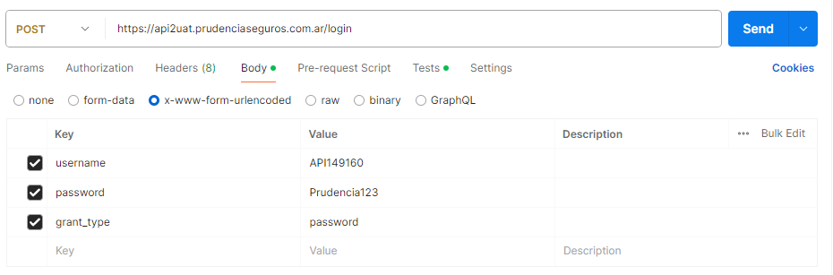

# EndPoints de Prudencia

Estos son los endpoints utilizados en el procesamiento para consultar la información desde la API de prudencia.

Cabe recalcar que no esta en uso actualmente este medio de obtener la información de las pólizas, pero el fin es implementarlo en un futuro próximo.

### Prudencia API

Este endpoint, implementado en el proyecto, permite el procesamiento masivo de las pólizas de Prudencia a través de su API.

-   Ruta: /operationPrudenciaMassive

Asegúrate de incluir la siguiente información en los encabezados de la solicitud:

-   **Authorization**: Bearer ```{token}```

Reemplaza token con el ```{token}``` de autenticación actualmente válido. Este token se puede obtener utilizando el endpoint de generación de tokens que se describe anteriormente.


### Generación de Tokens

Para obtener un token de Prudencia, con una duración de 24 horas, puedes utilizar el siguiente endpoint:

-   Método: POST
-   URL: [https://api2uat.prudenciaseguros.com.ar/login](https://api2uat.prudenciaseguros.com.ar/login)

Además, proporciona los siguientes detalles de autenticación:

-   **username**: API149160
-   **password**: Prudencia123
-   **grant_type**: password

### EJEMPLO



Una vez que envíes la solicitud con estos detalles, recibirás un token válido para utilizar durante las próximas 24 horas.

###   Obtención de Ramos

Para obtener los ramos de Prudencia, puedes utilizar el siguiente endpoint:

-   Método: GET
-   URL: [https://api2uat.prudenciaseguros.com.ar/Catalogos/GetRamos](https://api2uat.prudenciaseguros.com.ar/Catalogos/GetRamos)

Asegúrate de incluir los siguientes datos en los encabezados de la solicitud:

-   **Accept**: application/json
-   **Authorization**: Bearer ```{token}```

Reemplaza ```{token}``` con el token de autenticación actualmente válido. Este token se puede obtener utilizando el endpoint de generación de tokens que se describe anteriormente.

### Analizador / Polizas

Este endpoint se utiliza para consultar las pólizas mediante un analizador específico.

-   Método: GET
-   URL: [https://api2uat.prudenciaseguros.com.ar/analizadores/21/ejecutar](https://api2uat.prudenciaseguros.com.ar/analizadores/21/ejecutar)

Asegúrate de incluir los siguientes datos en los encabezados de la solicitud:

-   **Accept**: application/json
-   **Authorization**: Bearer ```{token}```

A continuación, se proporciona un ejemplo de cómo implementarlo en el código:

```const  response  =  await  axios.get('https://api2uat.prudenciaseguros.com.ar/analizadores/21/ejecutar', {
headers: {
'Authorization': `Bearer ${accessToken}`,
'Content-Type': 'application/json',
},
data: {
fec_emision: fec_emision
}
});
```

Se deben pasar ciertos parámetros. En primer lugar, el número "21" representa el tipo de listado en el cual se realiza la consulta. Este número puede ser modificado según las necesidades. Para conocer los diferentes tipos de listados disponibles, puedes consultar el endpoint **Listar**.

### Listar.

Este endpoint se utiliza para consultar los listados.

-   Método: GET
-   URL: [https://api2uat.prudenciaseguros.com.ar/Analizadores/Listar](https://api2uat.prudenciaseguros.com.ar/Analizadores/Listar)

Asegúrate de incluir los siguientes datos en los encabezados de la solicitud:

-   **Accept**: application/json
-   **Authorization**: Bearer ```{token}```

# Documentacion Prudencia
Si se requiere mas informacion, podes consultar la documentacion de la API de prudencia.
Link: https://api2uat.prudenciaseguros.com.ar/swagger/ui/index#/