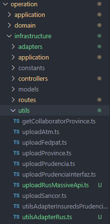
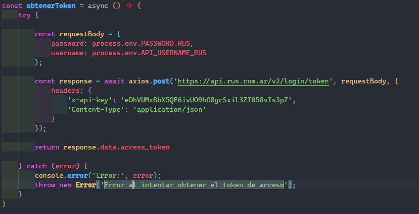
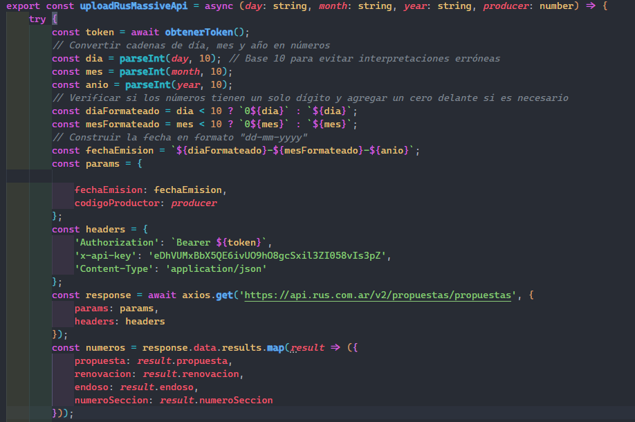
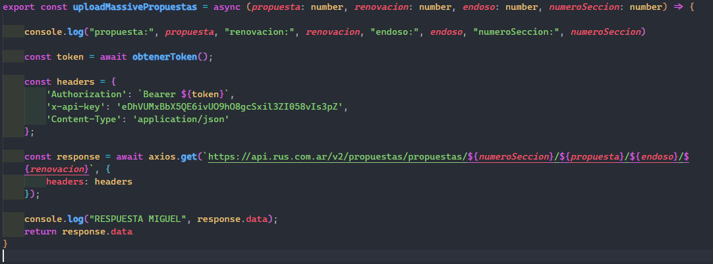
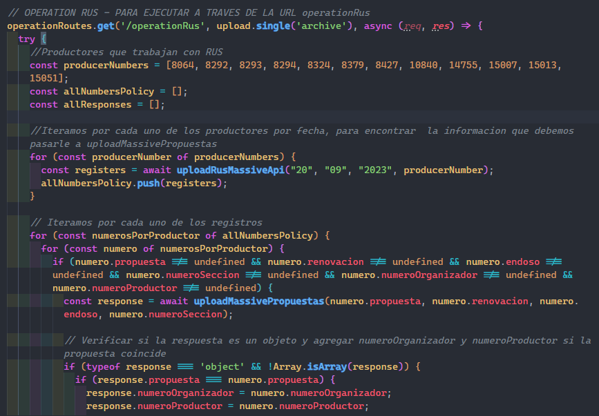
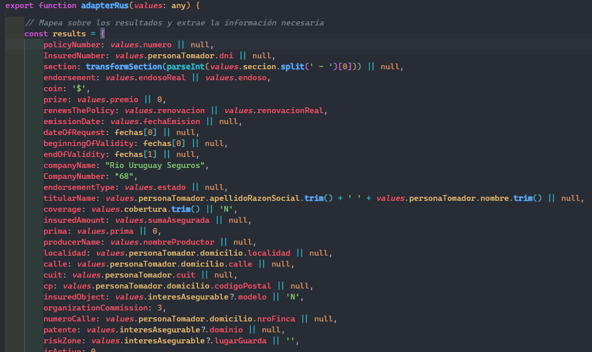
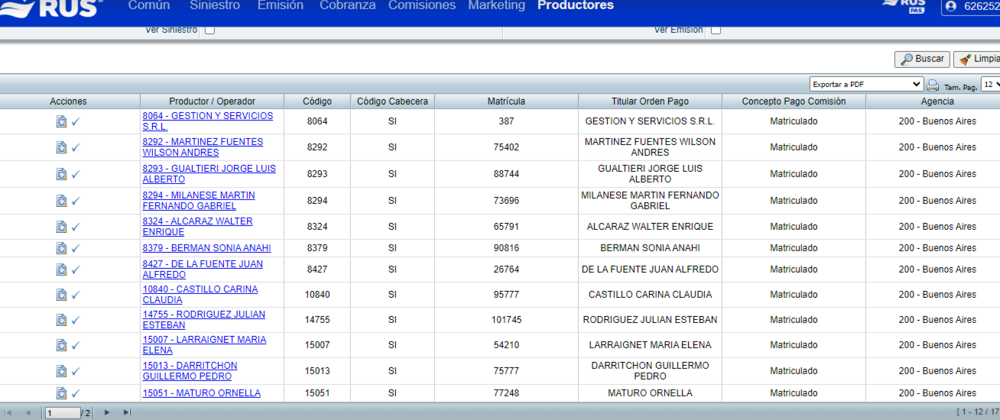
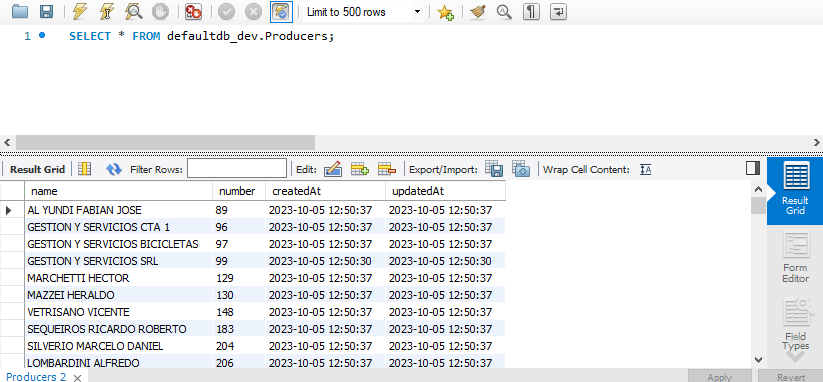
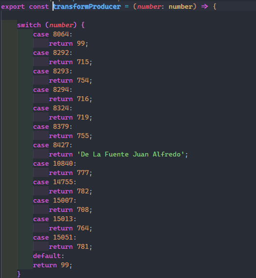
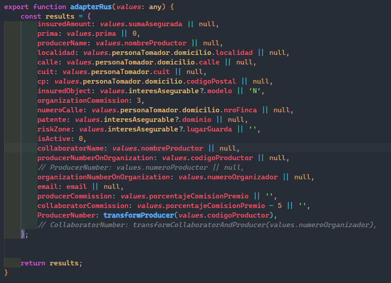

# Rio Uruguay Seguros API(RUS)

Toda la información recolectada sobre la **API** de **RUS** estará disponible acá, también la manera en que se implementó en el proyecto, para así tener una mejor comprensión sobre el proceso de implementación de la API en el SYS.

Dejo el Link de la documentacion proporcionada por Rio Uruguay Seguros en la seccion EndPoints.

### Integracion

La integracion de la API se aloja dentro de nuestro proyecto en la carpeta **Operation** -> **infrastructure** -> **utils** -> **uploadRusMassive**.

Una vez aca dentro de **uploadRusMassive** encontraremos tres funciones principales.

- **obtener Token**: En esta funcion pasamos nuestras credenciales, en este caso nuestra **x-api-key** junto a nuestro **usuario** y **contraseña**, esto devolvera un token, el cual utilizaremos en las demas peticiones. 

- **Obtener registro**: En esta función lo que hacemos es pasarle a una **fecha** y el número de **productor** al cual queremos consultar, la petición nos retorna ciertos registros que nos darán acceso a la información de la póliza completa en la siguiente función.

Para una explicación mas detallada, esta función lo que hace es obtener el numero de **propuesta**, la **renovación**, el **endoso** y el **número de sección**, con esto lograremos realizar la siguiente petición en la siguiente función.

- **Obtener Información de las Pólizas**: Esta es la última función, la cual consiste en pasarle los datos que obtuvimos en la función explicada anteriormente, la cual nos devolverá toda la información de las pólizas que necesitamos para continuar con el procesamiento de las mismas.

        

### Route

Después, en la carpeta Routes, utilizamos la funcion uploadMassiveApi, donde pasamos la fecha y recorremos todos los códigos de nuestros productores. La API nos devuelve información relacionada con la póliza. A partir de esta información, recolectamos los siguientes datos: **propuesta, renovación, endoso y número de sección**. Luego, continuamos con el procesamiento de estos datos.

El siguiente paso una vez obtenida la información desde la API en **uploadMassiveApi** es pasarle por parámetros a **uploadMassivePropuestas** y acá obtendremos toda la información las pólizas solicitadas.

### Adapter

A continuación, seguimos con el **adapter**, este moldea toda la información que obtuvimos para poder ingresarla en la base de datos. Cada campo o valor del adapter es modificado dependiendo la información entrante y la información requerida.

### Colaboradores y Productores

En esta sección, tenemos que hacer la solitud en la empresa en este caso **Rio Uruguay Seguros** de los códigos que tienen nuestros productores en esa empresa, para luego al ser almacenados en el **SYS** se logre hacer la conversión. 

**Ejemplo: **

En esta imagen podemos apreciar el nombre y el código de productor que tienen estas personas en Rio Uruguay Seguros.

Luego tenemos que buscar en nuestra base de datos los nombres de las personas y ver el código de productor que tienen en nuestra empresa.

A continuación con esta información ya obtenida, debemos hacer la conversión de los códigos que tenemos en **RUS** a los códigos que de nuestra empresa.

El último paso es utilizar esta función en nuestro adapter, que nos trae el código de nuestro productor en **RUS** y con la conversión podemos pasarlo al código que tiene ese productor en nuestra empresa.

Luego repetimos esta misma conversión con los colaboradores.

## Documentacion Rio Uruguay Seguros

Dejo toda la información recolectada de la compañía **Rio Uruguay Seguros**.

**Documentacion**: https://documenter.getpostman.com/view/17080944/2s9YBxaGsm

**Api-Key**: eDhVUMxBbX5QE6ivUO9hO8gcSxil3ZI058vIs3pZ

**Usuario**: 62625210/ws

**Password**: d30f8dj2$$wW

