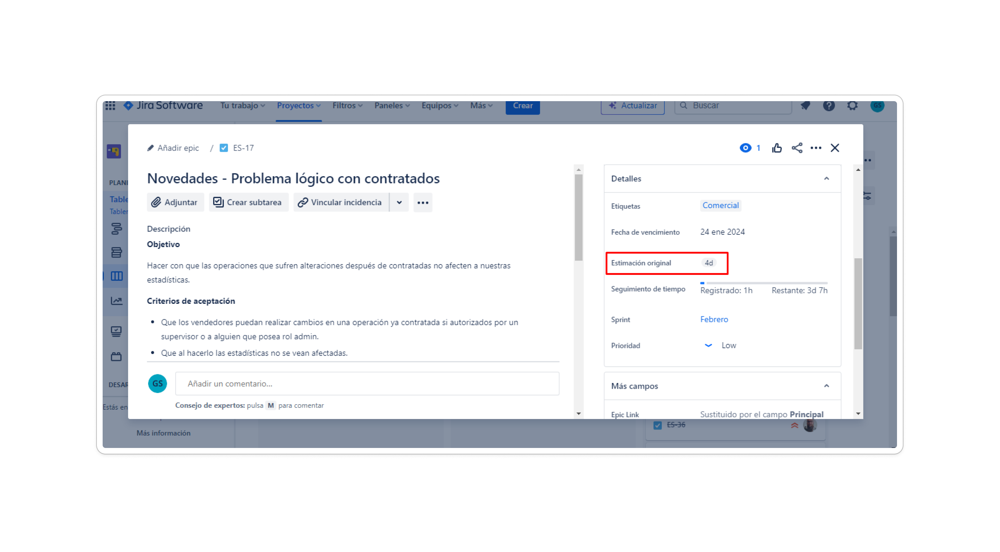
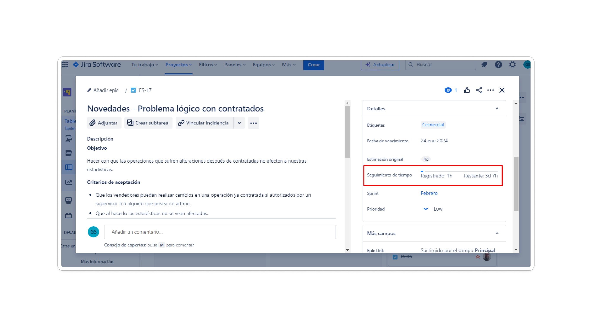
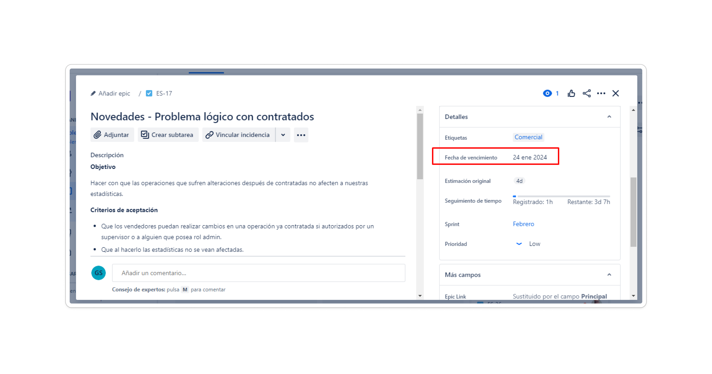
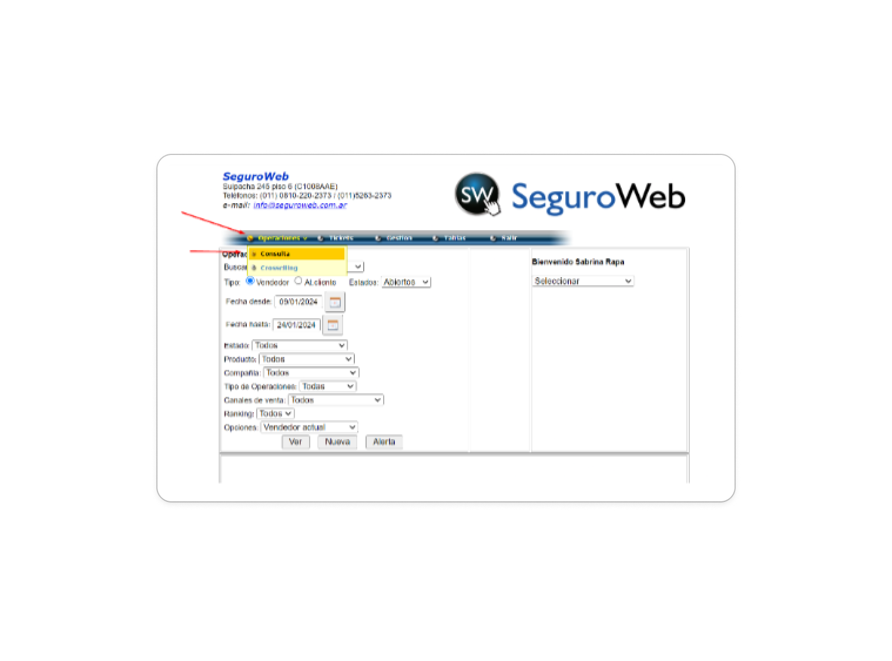
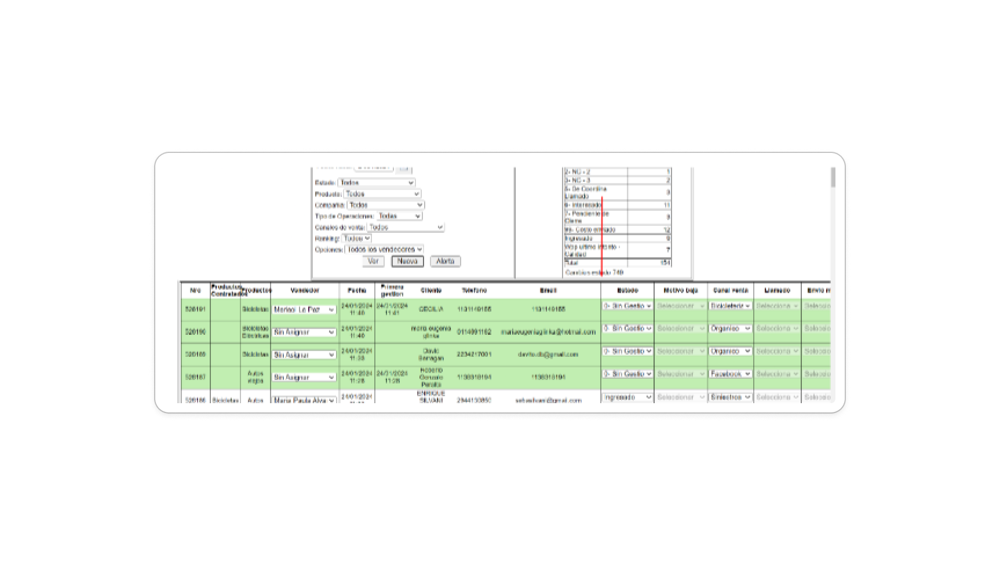

# Manejo de tareas

Para manejar los proyectos, crear tareas, asignar trabajos y hacer seguimiento del proceso utilizamos Jira, abajo compartimos un tutorial para que utilices la herramienta como todo un maestro.
 
## Asignación de tareas

Cuando te asignen una nueva tarea la podras ver en el tablero asociado al proyecto en el cuál estés laburando, en el costado inferior derecho de la tarea podras ver tu fotito.

## Prioridad

En Jira, las tareas se pueden asignar diferentes niveles de prioridad, que van desde muy alta hasta muy baja. Es importante abordar las tareas en función de su prioridad asignada. En situaciones donde múltiples tareas tienen la misma prioridad, se puede recurrir al orden en el tablero para diferenciarlas. Por ejemplo, si hay dos tareas con prioridad muy alta, se dará prioridad a aquella que esté ubicada más arriba en el tablero. Este enfoque ayuda a mantener la claridad y la eficiencia en la gestión de tareas en Jira.

## Estimación original

Cuando te asignen una tarea, lo primero que deberías hacer es estimarla, abajo te compartimos un imagen que ilustra adonde deberías efectuar esta estimación en Jira.

Al estimar el tiempo necesario para completar una tarea, es importante considerar algunos factores clave:

Las estimaciones deben abarcar el tiempo requerido para realizar la tarea de manera satisfactoria, lo que implica asegurar que el código sea **limpio** y funcional.
Aunque es común enfrentarse a la presión de los clientes para implementar nuevas funcionalidades, nuestra prioridad es reducir la deuda técnica y la complejidad del código. Esto garantiza que futuros cambios puedan realizarse de manera ágil y eficiente a mediano y largo plazo. Es tu responsabilidad asegurar que tu código cumpla con estos estándares.
Siempre es recomendable sobreestimar las tareas. Dado que la programación es un concepto abstracto, es fácil subestimar la complejidad de una tarea. Por ello, preferimos sobreestimarlas para evitar compromisos incumplibles. Como regla general, si estimas que una tarea podría tomarte **en el peor de los casos** 8 horas, deberías estimarla en 16 horas.

## Seguimiento de tiempo

Al completar una tarea o dejar de trabajar en ella, es crucial que registres el tiempo dedicado en el campo designado abajo y en la planilla de horas. Esta información puede ser necesaria en reuniones con la gerencia y nos ayuda a tomar decisiones informadas. Además, facilita que el supervisor acceda fácilmente a esta información para respaldar a su equipo.

## Fecha de vencimiento

Al comienzo de cada mes, es recomendable reunirse con el supervisor para definir juntos las metas a alcanzar durante ese periodo. Una vez que hayan acordado el tiempo estimado para completar una tarea, considerando su complejidad y la disponibilidad del desarrollador, el supervisor se comprometerá con otros departamentos indicando la fecha de finalización acordada. Este plazo es crucial, por lo que es importante sobreestimarlo, al igual que se hace con las estimaciones de tiempo. A continuación, adjunto una imagen de la sección donde se debe agregar esta información:

## Biopsia de una tarea 🦴

Haremos un breve recurrido a las informaciones más importantes de una tarea, tratando de hacer hincapie en las informaciones que deberian estar presentes en una task al momento de que vayas a encarar un nuevo desafio. En la actualidad, procuramos seguir una estructura específica al especificar una tarea, para que nuestros devs no se vuelvan locos al momento de descifrar una tarea.

A continuación, compartimos la estructura que empleamos en cada una de las tareas. Si notas alguna mejora potencial en tu código o en cualquiera de nuestros proyectos, lo ideal sería que creases una tarea en Jira y lo comunicases al supervisor del equipo. De esta forma, podremos priorizarla conjuntamente con la gerencia. Esta tarea debe seguir la estructura mencionada.

### Objetivo

En esta sección, es necesario resumir el objetivo que se busca alcanzar una vez que se haya
resuelto el problema o completado el desarrollo. Por ejemplo:

"Obtener la altura de las personas que realizan cotizaciones en nuestras landings"

### Criterios de aprobación

En esta sección, se deben enumerar los pasos y requisitos necesarios para lograr
satisfactoriamente el objetivo anterior. 

**Aquí hay un ejemplo:**

1. Agregar un nuevo campo en el formulario de cotización en todas las landings de la
empresa, como SeguroMascotas, SeguroBici, etc.
2. La información proveniente de este campo debe estar disponible en la nueva
operación generada por la cotización dentro del portal de novedades.
3. Las operaciones deben tener el estado de &#39;0-Sin Gestión&#39;.
4. Crear una nueva columna denominada &#39;altura&#39; que contenga estos datos para cada
operación.

### consideraciones

En esta sección, es esencial proporcionar toda la información necesaria para que el equipo de
sistemas identifique, comprenda y resuelva el problema. 

**Aquí tienes un ejemplo:**

- Las landings mencionadas anteriormente cuentan con un formulario de
cotización que debería ser actualizado para incluir el nuevo campo.

Considerando los estudios realizados en relación con la experiencia del usuario y con la
premisa de no alterar la estética existente, se sugiere que el nuevo campo se ubique
en la posición señalada por la flecha.

- Adicionalmente, la información introducida por el usuario en las landings debe
generar un nuevo dato en nuestro portal interno de novedades. Esto permitirá
que los vendedores puedan abordar a esta persona de manera efectiva. Dicha
información deberá ser accesible a través del menú situado en Operaciones -&gt;
Consulta.

- La nueva columna ‘Altura’ debe agregarse entre las columnas ‘Email’ y
‘Estado’.

### Consecuencias

En esta sección, es crucial añadir las repercusiones que experimentaría su sector en caso de no
contar con el nuevo desarrollo. 
**A continuación, se presenta un ejemplo:**

&#39;La ausencia de información sobre la altura limitaría nuestra capacidad para interactuar con el
cliente, resultando en una disminución en las oportunidades de ventas.&#39;